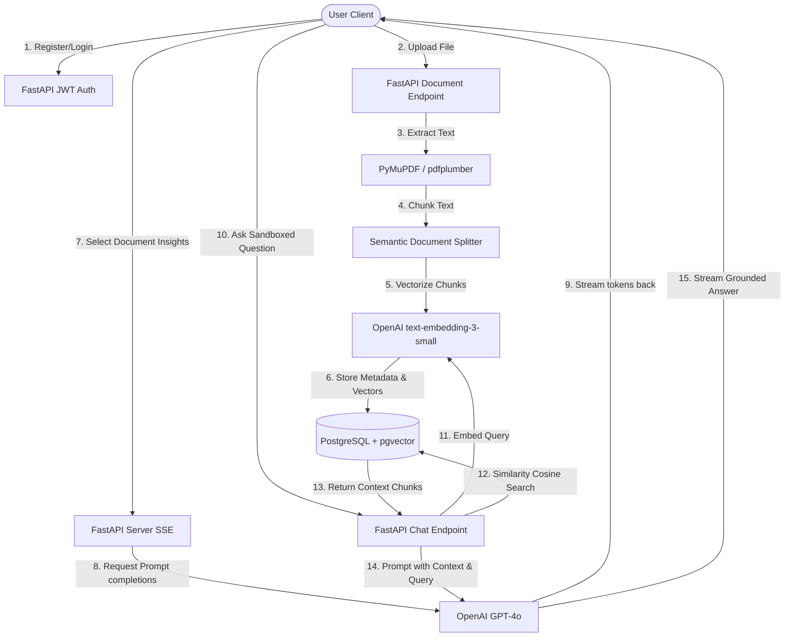

# Project Report: DocMind AI

**Project Title**: DocMind AI  
**Application Name**: DocMind AI  
**Live Application URL**: https://docmind-ai.ap-south-1.awsapprunner.com  

---

## 1. Application Overview & Technical Stack
DocMind AI is a production-grade, secure document analysis and retrieval system. It allows users to register accounts, upload documents, inspect parsed texts with advanced highlight-based term matching, extract 20+ progressively streamed summaries/insights, and execute secure context-constrained QA chats.

```
+-------------------------------------------------------------+
|                        TECHNOLOGY STACK                     |
+---------------------+---------------------------------------+
| Core Frontend       | React (Vite, TS, Tailwind CSS v4)     |
| Logic & Transitions | Framer Motion, React Markdown         |
| Web Backend Server  | Python FastAPI (Uvicorn Async)        |
| Database Storage    | PostgreSQL + pgvector extension       |
| AI Models/LLM       | OpenAI (GPT-4o & text-embedding-3)    |
| Libraries           | PyMuPDF, pdfplumber, python-docx,     |
|                     | reportlab, SQLAlchemy, asyncpg        |
| Deployment Env      | Docker Containers, AWS App Runner     |
+---------------------+---------------------------------------+
```

---

## 2. System Architecture
The application employs a decoupled client-server architecture, fully containerized into a multi-stage Docker environment. In development, the React SPA and FastAPI backend run in separate containers, communicating via CORS-enabled REST/streaming routes. In production (AWS App Runner), the compiled React SPA static assets are bundled inside the FastAPI image and served directly from Python to eliminate CORS overhead, simplify SSL termination, and enable single-port mapping (8080).

### Data Flow Diagram (RAG & Extraction Pipeline):


---

## 3. Prompt Engineering Strategy
The application relies heavily on system prompt constraints, few-shot structures, and JSON format control to achieve high reliability and prevent hallucinations.

### 3.1. Strict Sandbox RAG Chat Prompt
To prevent OpenAI models from answering questions based on general knowledge instead of the uploaded document, we employ strict boundary constraints:
```
You are a strictly contextual document assistant. Answer the user's questions ONLY using the provided document chunks as context. 
If the answer cannot be found in the context, respond exactly with: 
"I'm sorry, but that information is not available in the uploaded document." 
Do not make up facts, do not use outside knowledge, and do not reference any information outside the provided text.

Document Context:
{context}
```

### 3.2. Structured Metadata JSON Extraction
To capture metrics (sentiment, tone, difficulty, language, classification) synchronously upon upload, we instruct GPT-4o with a precise schema constraint combined with the `response_format={"type": "json_object"}` API flag:
```
Analyze the following text extract and provide key structural classifications.
You MUST respond ONLY with a valid JSON object matching this schema:
{
    "sentiment": "Positive" | "Negative" | "Neutral",
    "tone": "Formal" | "Casual" | "Technical" | "Assertive" | "Persuasive",
    "difficulty": "Easy" | "Medium" | "Hard" | "Technical Expert",
    "language": "English" | "Spanish" | "French" | "German" | etc.,
    "classification": "Legal Document" | "Financial Report" | "Scientific Paper" | "Meeting Notes" | "Product Requirement Document" | "General Text"
}

Text to analyze (first 3000 words):
{text}
```

---

## 4. Phase-by-Phase Development Summary

### Phase 1: Conceptualization & DB Architecture
- Design database schemas for `users`, `documents`, `document_chunks`, and `chat_messages` using SQLAlchemy.
- Set up migration scripts to automatically build tables and load the PostgreSQL `pgvector` extension.

### Phase 2: Backend Development (API and AI pipelines)
- Implement asynchronous endpoint routes for authentication (JWT creation, password hashing with bcrypt, custom middleware verification).
- Build the extraction pipeline using `PyMuPDF` (for layout analysis and speed) and `pdfplumber` (as a robust fallback for tables), combined with `python-docx` for Word files and native text parsing.
- Build chunking algorithms using a token-based sliding window to retain context.
- Implement streaming HTTP responses (`StreamingResponse`) for token-by-token completion.

### Phase 3: Frontend Development & UI Design
- Create the dashboard with React, Tailwind CSS, and TypeScript.
- Implement progressive state management to handle dynamic file uploads and real-time streaming charts.
- Build interactive readers featuring a search bar that leverages yellow neon overlays to highlight matches dynamically.

### Phase 4: Containerization & Cloud Deployment
- Create a multi-stage `Dockerfile` to compile the Vite React production bundle and copy it directly into the FastAPI runner directory.
- Test multi-container builds locally using Docker Compose.
- Establish ECR repositories, build and push production Docker images, configure RDS Postgres databases on AWS, and deploy to AWS App Runner.

---

## 5. Challenges & Resolutions

### Challenge 1: App Runner Ephemeral Filesystems & Static Serving
- **Problem**: In local development, the React and FastAPI servers run on separate ports. Deploying them on App Runner as separate containers is costly and complex due to port mappings.
- **Resolution**: We configured a multi-stage `Dockerfile`. In Stage 1, we build the static React assets using `npm run build`. In the final Python container stage, we copy these assets to `/dist` and mount them in FastAPI using `StaticFiles`. The FastAPI server serves the compiled UI static assets from the root path (`/`) while handling API requests under `/api`. This allows us to run the entire app on a single App Runner port (`8080`).

### Challenge 2: Handling Vector Storage & PostgreSQL Extensions in the Cloud
- **Problem**: The local PostgreSQL container utilizes pre-bundled `pgvector`. Standard cloud databases may not have the vector extension loaded, causing SQL query crashes.
- **Resolution**: In our FastAPI startup sequence (`app.on_event("startup")`), we execute a SQL command check `CREATE EXTENSION IF NOT EXISTS vector;`. When setting up AWS RDS PostgreSQL, we selected database engine parameter groups that support `pgvector` and verified that incoming connections from the App Runner security groups are correctly authorized.

### Challenge 3: Streaming Completeness over App Runner Timeouts
- **Problem**: When generating extensive insights or long summaries, standard HTTP requests might time out on App Runner if the connection remains idle without receiving active bytes.
- **Resolution**: We transitioned all long-running AI queries (summaries, insights, FAQ generation, chats) into progressive stream generators using FastAPI's `StreamingResponse`. Sending tokens continuously down the HTTP stream keeps the App Runner routing layers active and avoids timeouts.

---

## 6. Key Learnings & Reflections
- **AI-Native Efficiency**: Leveraging AI agents and prompt engineering speeds up boilerplate creation, allowing developers to focus on higher-level architecture and cloud configuration.
- **Docker Portability**: Containerizing the app early ensures that "it works on my machine" translates seamlessly to the cloud. Docker simplified local database integration with pgvector and facilitated App Runner ECR uploads.
- **Robust Grounding**: Implementing a strict RAG context boundary is essential for commercial document applications to guarantee data accuracy and maintain user trust.
